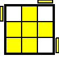
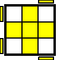
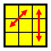
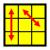

# CFOP

## Cross

try for <10 moves

## FTL

try for <=4 cube rotations

## Two-look OLL

### bottom: edges

|     | Name | Alg | Image desc |
| --- | --- | --- | --- |
|  | bar | ```F R U R' U' F'  ==  F (sexy) F'``` | ```xUx===xDx```|
|  | ell | ```f R U R' U' f'  ==  f (sexy) f'``` | ```xUxL==x=x``` |

### corner algs

|     | Sym | Names | Alg | Left | Image desc |
| --- | ----   | ---   | --- | :---: | --- |
|  | S      | OLL 27, Sune | ```R U R' U R U2 R'``` | | ```U=R=====D``` |
|  | S- | OLL 26, Anti-sune | ```L' U' L U' L' U2 L``` | * | ```L=U=====R``` |
|  | H | OLL 21, Double-sune | ```R U R' U R U' R' U R U2 R'``` | | ```L=R===L=R``` |
|  | Pi | OLL 22 | ```R U2 R2' U' R2 U' R2' U2 R``` | | ```L=U===L=D``` |
|  | U | OLL 23 | ```R2 D R' U2 R D' R' U2 R'``` | | ```F=====D=D``` |
|  | T | OLL 24 | ```B' R' F R B R' F' R``` | | ```L=R======``` |
|  | L | OLL 25 | ```F R' F' L F R F' L'``` | | ```F=R===D==``` |

## One-look PLL

|    | Sym | Prob | Code | Alg | Image desc |
| ---| --- | ---  | --- | ---  | --- |
|  | H | 1/72 | | ```M2' U M2' U2 M2' U M2'``` | ```2<>8``` |
|  | Ua | 1/18 | R | ```F2 U' M U2 M' U' F2``` | ```8>6 6>4 4>8``` |
|  | Ub | 1/18 | R | ```F2 U M U2 M' U F2``` | ```8>4 4>6 6>8``` |
|  | Z | 1/36 | | ```(M2' U M2' U) (M' U2) (M2' U2 M') [U2]``` | ```2<>4 6<>8``` |
|  | Aa | 1/18 | L | ```l' U R' D2 R U' R' D2 R2``` | ```1>3 3>9 9>1``` |
|  | Ab | 1/18 |  | ```r U' L D2 L' U L D2 L2``` | ```7>3 3>1 1>7``` |
|  | E | 1/36 | ? | `````` | ```1<>7 3<>9``` |
|  | F | 1/18 | ? | `````` | ```2<>8 3<>9``` |
|  | Ga | 1/18 | ? | ```R2 u R' U R' U' R u' R2 F' U F``` | ```1>3 3>7 7>1 2>4 4>6 6>2``` |
|  | Gb | 1/18 | ? | `````` | ```3>1 7>3 1>7 4>2 6>4 2>6``` |
|  | Gc | 1/18 | L? | ```L2 u' L U' L U L' u L2 F U' F'``` | ```9>3 3>1 1>9 6>4 4>2 2>6``` |
|  | Gd | 1/18 | L? | `````` | ```3>9 1>3 9>1 4>6 2>4 6>2``` |
|  | Ja | 1/18 | | ```R' U L' U2 R U' R' U2 L R U'``` | ```2<>4 1<>3``` |
|  | Jb | 1/18 | L | ```L U' R U2 L' U L U2 R' L' U ``` | ```1<>3 2<>6``` |
|  | Na | 1/72 |  | `````` | ```3<>7 4<>6``` |
|  | Nb | 1/72 |  | `````` | ```1<>9 4<>6``` |
|  | Ra | 1/18 | L | **`y R U R' F' R U2 R' U2 R' F R U R U2 R'`** | ```1<>3 4<>8``` |
|  | Rb | 1/18 |  | `````` | ```1<>3 6<>8``` |
|  | T | 1/18 |  | ```R U R' U' R' F R2 U' R' U' R U R' F'``` | ```3<>9 4<>6``` |
|  | V | 1/18 |  | `````` | ```1<>9 2<>6``` |
|  | Y | 1/18 |  | `````` | ```2<>4 1<>9``` |

Codes: L = left hand, ? = don't know, R = revisit for better alg

    E (1/36):   ???
    F (1/18):   ???
    Gb (1/18):  ???
    Gd (1/18):  ???
    Na (1/72):  ???
    Nb (1/72):  ???
    Ra (1/18):  (learning)
    Rb (1/18):  ???
    V (1/18):   ???
    Y (1/18):   ???

??? = I don't have an alg memorized for this.  
*** = Mirror using left hand.
