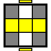

# CFOP

## Cross

try for <10 moves

## FTL

try for <=4 cube rotations

## Two-look OLL

### bottom: edges

|     | Name | Alg |
| --- | --- | --- |
|  | bar | ```F R U R' U' F'  ==  F (sexy) F'``` |

### corner algs
    S (Sune, OLL 27):        R U R' U R U2 R'
    S- (Anti-sune, OLL 26):  L' U' L U' L' U2 L  ***
    H (Dbl-sune, OLL 21):    R U R' U R U' R' U R U2 R'
    Pi (OLL 22):             R U2 R2' U' R2 U' R2' U2 R
    U (OLL 23):              R2 D R' U2 R D' R' U2 R'
    T (OLL 24):              y B' R' F R B R' F' R
    L (OLL 25):              y2 F R' F' L F R F' L'


## One-look PLL

    H (1/72):   M2' U M2' U2 M2' U M2'
    Ua (1/18):  y2 F2 U' M U2 M' U' F2
    Ub (1/18):  y2 F2 U M U2 M' U F2
    Z (1/36):   (M2' U M2' U) (M' U2) (M2' U2 M') [U2]
    Aa (1/18):  l' U R' D2 R U' R' D2 R2 (x')
    Ab (1/18):  y' r' U' L D2 L' U L D2 L2 ***
    E (1/36):   ???
    F (1/18):   ???
    Ga (1/18):  y R2 u R' U R' U' R u' R2 F' U F  ***
    Gb (1/18):  ???
    Gc (1/18):  y' L2 u' L U' L U L' u L2 F U' F'
    Gd (1/18):  ???
    Ja (1/18):  y R' U L' U2 R U' R' U2 L R U'
    Jb (1/18):  y' L U' R U2 L' U L U2 R' L' U ***
    Na (1/72):  ???
    Nb (1/72):  ???
    Ra (1/18):  y R U R' F' R U2 R' U2 R' F R U R U2 R' (learning)
    Rb (1/18):  ???
    T (1/18):   R U R' U' R' F R2 U' R' U' R U R' F'
    V (1/18):   ???
    Y (1/18):   ???

??? = I don't have an alg memorized for this.  
*** = Mirror using left hand.
