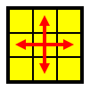
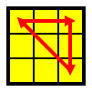

# CFOP

## Cross

try for <10 moves

## FTL

try for <=4 cube rotations

## Two-look OLL

### bottom: edges

|                        | Name | Alg                               |
| ---                    | ---  | ---                               |
|  | bar  | `F R U R' U' F'  ==  F (sexy) F'` |
|  | ell  | `f R U R' U' f'  ==  f (sexy) f'` |

### corner algs

|                            | Sym  | Names               | Alg                          | Left  |
| ---                        | ---- | ---                 | ---                          | :---: |
|  | S    | OLL 27, Sune        | `R U R' U R U2 R'`           |       |
|  | S-   | OLL 26, Anti-sune   | `L' U' L U' L' U2 L`         | *     |
|  | H    | OLL 21, Double-sune | `R U R' U R U' R' U R U2 R'` |       |
|  | Pi   | OLL 22              | `R U2 R2' U' R2 U' R2' U2 R` |       |
|  | U    | OLL 23              | `R2 D R' U2 R D' R' U2 R'`   |       |
|  | T    | OLL 24              | `B' R' F R B R' F' R`        |       |
|  | L    | OLL 25              | `F R' F' L F R F' L'`        |       |

## One-look PLL

|                      | Sym | Prob | Code | Alg                                                    |
| ---                  | --- | ---  | ---  | ---                                                    |
|  | Ua  | 1/18 | R    | `F2 U' M U2 M' U' F2`                                  |
|  | Ub  | 1/18 | R    | `F2 U M U2 M' U F2`                                    |
|    | Z   | 1/36 |      | `(M2' U M2' U) (M' U2) (M2' U2 M') [U2]`               |
|    | H   | 1/72 |      | `M2' U M2' U2 M2' U M2'`                               |
|  | Aa  | 1/18 | L    | `l' U R' D2 R U' R' D2 R2`                             |
|  | Ab  | 1/18 |      | `r U' L D2 L' U L D2 L2`                               |
|    | E   | 1/36 | N    | `x' (R U' R' D) (R U R' D') (R U R' D) (R U' R' D') x` |
|  | Ra  | 1/18 | NL   | `R U R' F' R U2 R' U2 R' F R U R U2 R' [U']`           |
|  | Rb  | 1/18 | N    | `L' U' L F L' U2 L U2 L F' L' U' L' U2 L [U]`          |
|  | Ja  | 1/18 |      | `R' U L' U2 R U' R' U2 L R U'`                         |
|  | Jb  | 1/18 | L    | `L U' R U2 L' U L U2 L' R' U `                         |
|    | T   | 1/18 |      | `R U R' U' R' F R2 U' R' U' R U R' F'`                 |
|    | F   | 1/18 | ?    | ``                                                     |
|    | V   | 1/18 |      | ``                                                     |
|    | Y   | 1/18 |      | ``                                                     |
|  | Na  | 1/72 |      | ``                                                     |
|  | Nb  | 1/72 |      | ``                                                     |
|  | Ga  | 1/18 | ?    | `R2 u R' U R' U' R u' R2 F' U F`                       |
|  | Gb  | 1/18 | ?    | ``                                                     |
|  | Gc  | 1/18 | L?   | `L2 u' L U' L U L' u L2 F U' F'`                       |
|  | Gd  | 1/18 | L?   | ``                                                     |

Codes: L = left hand, ? = don't know, R = revisit for better alg, N = new, learning now

[//]: # (MACHINE PROCESSED INFO FOLLOWS THIS COMMENT)

[//]: # (ollimage specs for all of the OLL algs that I know.)
[//]: # (bar  xUx===xDx)
[//]: # (ell  xUxL==x=x)
[//]: # (oll27  U=R=====D)
[//]: # (oll26  L=U=====R)
[//]: # (oll21  L=R===L=R)
[//]: # (oll22  L=U===L=D)
[//]: # (oll23  F=====D=D)
[//]: # (oll24  L=R======)
[//]: # (oll25  F=R===D==)

[//]: # (pllimage specs for all of the PLL algs that I know.)
[//]: # (ua  8>6 6>4 4>8)             
[//]: # (ub  8>4 4>6 6>8)             
[//]: # (z  2<>4 6<>8)               
[//]: # (h  2<>8 4<>6)               
[//]: # (aa  1>3 3>9 9>1)             
[//]: # (ab  7>3 3>1 1>7)             
[//]: # (e  1<>7 3<>9)               
[//]: # (ra  3<>9 4<>2)               
[//]: # (rb  1<>7 2<>6)               
[//]: # (ja  2<>4 1<>3)               
[//]: # (jb  1<>3 2<>6)               
[//]: # (t  3<>9 4<>6)               
[//]: # (f  2<>8 3<>9)               
[//]: # (v  1<>9 2<>6)               
[//]: # (y  2<>4 1<>9)               
[//]: # (na  3<>7 4<>6)               
[//]: # (nb  1<>9 4<>6)               
[//]: # (ga  1>3 3>7 7>1 2>4 4>6 6>2)
[//]: # (gb  3>1 7>3 1>7 4>2 6>4 2>6)
[//]: # (gc  9>3 3>1 1>9 6>4 4>2 2>6)
[//]: # (gd  3>9 1>3 9>1 4>6 2>4 6>2)
